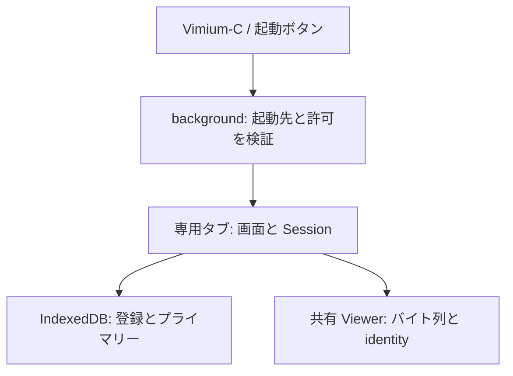

# ローカル PDF ブラウザの画面・保存・Viewer・Vimium-C 統合仕様

## 適用範囲と実装状態

[基本仕様](vimium-local-browser.md) の複数登録・プライマリー・キー操作を、実際の拡張画面へ接続する要件。モデル、専用画面、IndexedDB アダプター、共有 Viewer runtime、外部起動リスナー、設定 UI を実装済み。[統合テストの契約・対応表](local-browser-testing.md) に自動テストと未実施の実機確認を記録する。

| 領域 | 採用する構成 | 現在のコードとの接点 |
| --- | --- | --- |
| 拡張画面 | 専用の通常タブ内で一覧と PDF 表示を切り替える | `LocalBrowserSession`、新しい `browser.html` / `browser.ts` |
| 登録保存 | 拡張オリジンの IndexedDB に native handle とプライマリーを保存 | `FolderStorage`、`FolderRegistry` |
| Viewer | 同じ document 内で `File` のバイト列とモデルの identity を渡す | `Viewer.load(PdfSource)`、`MarksStore`、既存検索・パスワード保存 |
| Vimium-C | `sendToExtension` の exact command で専用タブを開くだけ | background の独立した `onMessageExternal` リスナー |



ファイル名検索は現在の一覧の絞り込み、PDF 本文検索は表示中の PDF に対する既存 Viewer の検索。全登録フォルダの再帰走査、全文索引、OS 上の未登録の親フォルダへの移動、Native Messaging は対象外。

## 拡張画面の要件

### ページと表示

- 追加ページは `src/local-browser/browser.html`。`vite.config.ts` の build entry に含め、配布用 `dist/` に HTML・JS・CSS が揃うこと。popup ではなく、前面の通常タブとして開く。
- ページを `web_accessible_resources` に追加しない。通常 Web ページへの公開や content script 注入でフォルダアクセスを実現しない。埋め込み状態で起動した場合は登録 DB や picker に触れず終了する。
- 通常起動は保存プライマリーのルートから開始する。URL や前回の子フォルダを起動位置にしない。呼び出しごとに新しい専用タブを 1 件作り、表示中の PDF タブを使い回して変更しない。
- 上部に登録フォルダ名・その中の相対位置・一覧の種類、中央に一覧、下部に検索入力・処理中状態・エラー・操作案内を表示する。絶対パスを表示できるとは仮定しない。
- 登録一覧は登録順とプライマリー表示を保つ。同名の登録は短い登録 ID を併記し、短縮後も衝突する場合は区別できる長さにする。選択中とプライマリーを別に示す。
- 未登録、空フォルダ、検索結果なし、権限確認、初期化失敗、API 非対応を区別する。空一覧で開く操作や選択表示を残さない。
- 一覧と Viewer は排他的に表示する。非表示領域はフォーカス移動とキー処理の対象から外す。既存テーマ設定を利用し、初期化や文書交換のたびに設定リスナーを重複登録しない。

### DOM とキー配送

画面の大状態は `files` / `loading-pdf` / `pdf`。`files` の内側は Session の `empty` / `browse` / `roots` / `permission` に対応する。エラー表示はこの状態に付随し、不明な状態を未登録とみなして保存を始めない。

| 対象 | キー処理とフォーカス |
| --- | --- |
| 一覧の通常モード | Session に配送。選択行をスクロール範囲内に表示 |
| 名前検索欄 | `/` でフォーカス。文字列は `input` で渡す。合成中はコマンドを実行せず、`Enter` / `Esc` の終了後に一覧へ戻す |
| PDF 通常モード | 既存 `VimController` に配送。`/`、`n` / `N` は PDF 本文検索 |
| パスワード・保存などのダイアログ | ダイアログがキーを所有する。Session の busy 処理で文字や `Enter` を奪わない |
| toolbar の button・他の入力欄 | native の操作を優先し、キー配送と native click で同じ操作を 2 回実行しない |

`session.key(event)` はイベントハンドラー内で直接呼ぶ。戻り値が同期的な `false` 以外なら、その場で `preventDefault()` する。Promise の完了を待ってから既定動作を抑えない。処理開始直後に busy を描画し、完了・例外の双方で再描画する。処理中の検索入力も無効にして、見えている文字列とモデルの filter を食い違わせない。IME の入力欄は毎回作り直さず、`Tab` と未対応キーを横取りしない。

一覧はフォーカス可能な listbox と option、または同等の accessible な構成を使い、選択・プライマリー・処理中を支援技術へ伝える。名前は `textContent` で表示する。クリックは選択のみ、ダブルクリックは選択後の確定。クリックによるハイライトだけではプライマリーを保存しない。

「登録フォルダ一覧」「フォルダを追加」「再試行」「通常の PDF ファイル選択」「設定を開く」を状況に応じて配置する。picker と再許可は実際のキー・click ハンドラーから直接開始し、DB 初期化、Web Lock、別イベントへの転送を先に await しない。初期化が済むまで関連ボタンを無効にし、その間の操作を後から自動実行しない。

登録解除は登録一覧の各行から実行する。解除対象を名前と ID で示して確認し、保存成功後に一覧を更新する。選択中のルートを解除した場合は古い browse snapshot への取消を無効にする。残存登録がなければ未登録画面へ戻る。解除だけで既存 PDF のページ位置・マーク・ハイライト・パスワードを削除せず、すでに読み込まれた PDF の強制終了もしない。

### PDF から一覧へ戻る

一覧の Session は PDF を表示しても破棄せず、現在位置・filter・選択を保持する。読み込み成功後に同じタブ内で PDF 画面へ切り替え、同一 document の履歴に PDF 表示を追加する。PDF 通常モードの既存 `H`、ブラウザの「戻る」、表示上の「一覧へ戻る」で直前の一覧へ戻る。`h` は PDF の横スクロールのまま。裸の `Esc` を一覧への強制復帰に変更しない。

履歴には画面の種類と opaque な文書 token だけを置く。handle、File、バイト列を URL や history state に入れない。保持する PDF は最大 1 文書とし、進む操作は token が保持中の文書と一致した場合だけ再表示する。置き換え済みの文書は再選択を案内し、identity を URL として fetch しない。ページ再読み込みでは履歴の PDF を自動復元せず、保存プライマリーのルートから始める。

## IndexedDB 保存の要件

### 保存形式

| 項目 | 契約 |
| --- | --- |
| DB 名 / DB schema version | `vimdf.local-browser` / `1` |
| object store / key | `registry` / `state` |
| 保存 envelope | `{revision:number,state:{version:1,roots:[{id,handle}],primaryId}}` |
| 未保存 | `load()` は `null` を返す。最初の比較用 revision は `0` |
| ID | 登録時の `crypto.randomUUID()`。プライマリー変更・復元で再生成しない |

`handle` は native `FileSystemDirectoryHandle` をそのまま structured clone で保存する。JSON 化、絶対パス化、`chrome.storage.sync` への保存・端末間同期をしない。非対応時に文字列へ変換して保存成功と表示しない。名前・一覧・PDF 本文をキャッシュ DB に追加しない。プライマリーの許可失効は登録削除と区別する。

### トランザクションと複数タブ

1. `load()` は readonly transaction で envelope を読み、revision をアダプター内部に保持して model の State だけを返す。revision は非負の safe integer とし、schema・revision の不正は例外にする。モデルによる ID・handle・プライマリー参照の検証も維持する。
2. `save(State)` は 1 readwrite transaction 内で現在の revision を再読取し、最後に読んだ値と比較する。一致した場合だけ `revision + 1` と State をまとめて保存する。safe integer の上限なら保存を拒否し、通知しない。request の成功時ではなく transaction の `complete` で resolve する。
3. 不一致は `storage-conflict` として transaction を abort し、旧状態を上書きしない。`FolderRegistry` がメモリーを更新する前に reject する。単に保存処理を直列化して古い State を順番に書く方式では要件を満たさない。
4. transaction 内で picker・許可要求・`isSameEntry()`・ファイル読取・ネットワーク処理を await しない。必要な照合や許可確認は transaction を作る前に済ませ、IDB の request callback 内で比較と put を続ける。
5. commit 後に BroadcastChannel `vimdf.local-browser.registry.v1` で revision だけを通知する。通知のない場合も、画面が再び前面になった際に revision を確認する。通知を DB の正本にしない。

更新を検知しても、他のタブの表示中のフォルダや PDF を勝手に切り替えない。「登録が更新されました」を表示し、新たな一覧移動・PDF 読取・登録変更の前に最新状態の再読み込みを促す。再読み込みは最新のプライマリーのルートから開始する。保存競合では自動上書き・自動再実行をせず、最新の登録を復元してから利用者が再度選択する。確認や許可済みの結果を古い登録へ適用しない。

`FolderRegistry` は同じプライマリーの明示確定も save による revision の比較・commit を通す。古いタブが「すでにプライマリー」と判断して、DB に保存された別のプライマリーを無視するケースを防ぐ。重複フォルダの追加自体は既存契約どおり ID を再利用して保存せず、更新通知があれば最新一覧の再読み込みを促す。

### 障害と保存の寿命

保存の失敗・abort・quota 超過では旧登録と旧プライマリーを維持し、成功表示をしない。DB open 失敗、将来バージョン、不正データを空の設定で上書きしない。`versionchange` では接続を閉じ、再読み込みを案内する。upgrade が他タブに妨げられた場合は待機理由を表示する。データ初期化を実装する場合は登録専用の明示操作とし、全般設定のリセットやパスワード削除と連動させない。

同じ拡張 ID とブラウザプロファイルで再起動・拡張更新後も ID とプライマリーを復元する。アンインストール、プロファイル削除、拡張 ID の変更を越える保持は保証しない。保存ハンドルの復元と読取権限の保持は別であり、毎回 API で確認する。シークレットの専用ページは DB を開く前に処理を止める。

## Viewer 接続の要件

### 共通 runtime とデータ経路

Viewer クラスは `src/viewer/core.ts`、通常 URL / MIME 起動は `viewer.ts`、共有コントローラーと設定購読は `runtime.ts` に分離した。既存 `viewer.html` と新しい `browser.html` は共通 runtime を使う。新しいページへの import で MIME stream 解決や通常ファイル選択画面を勝手に開始しない。共有 HTML 部品の Viewer 要素 ID は 1 ページに 1 組とし、ブラウザの名前検索欄と PDF の `searchInput` を別にする。

モデルの `openPdf(File,identity)` は、`File.arrayBuffer()` を経て `viewer.load({data,identity})` へ接続する。`url` を設定せず、synthetic identity をネットワーク取得、DNR redirect、native viewer bypass に渡さない。File、handle、ArrayBuffer を `chrome.runtime.sendMessage()` で background へ運ばない。Chrome の拡張メッセージは JSON serialization のため、このデータ経路には用いない。

identity はモデルの `https://local-pdf.vimdf.invalid/<登録 ID>/<相対パス>` をそのまま使用する。filename・size、blob URL、絶対パスを使う既存の通常ファイル選択用 identity に置き換えない。ページ位置・マーク・ハイライト・パスワードはこの同じ identity へ接続する。別ルートの同名 PDF は分離し、プライマリーを往復しても保存先が変わらない。

### 文書交換とキー処理

読み込み中は `loading-pdf` として二重起動を防ぎ、取消を提供する。取消・失敗では一覧の位置・filter・選択を保持し、成功していない PDF の履歴を追加しない。読取失敗をフォルダの登録解除に結び付けない。

| 境界 | 必須の扱い |
| --- | --- |
| 文書を交換する前 | 旧文書の保存タイマーを処理し、identity・page・scroll を snapshot として flush。新文書の状態を旧文書の key に保存しない |
| 新文書の準備 | パスワード処理・文書読込・新マーク読込を行い、操作を停止した状態で成功後に identity と store を切り替える。先に `marks.retarget()` して旧 PDF の操作を続けない |
| 失敗・取消 | 旧 store のまま回復し、未開封文書へのページ位置やマーク保存をしない。キャンセル後の遅い結果を破棄 |
| 一覧へ復帰 | PDF の連続スクロールを停止し、pending キーや一時モードを解除。Viewer のキー処理を停止して Session へ配送 |
| ページ終了・文書破棄 | loading task を abort / destroy し、旧 document、イベントリスナー、timer、一時 URL を解放 |

既存の Viewer は document 全体の keydown / keyup リスナーを attach する。統合では suspend / resume / dispose、または同等の単一ルーターを追加し、一覧と Viewer が同じキーを両方処理しないようにする。非表示の Viewer がフォーカスを奪ったり、`/` を PDF 検索として処理したりしないこと。

Viewer の非同期 load、outline、highlight、restoreState、遅延 save は文書の generation を照合する。`snapshot()` / `saveSnapshot()` / `flush()` は await 前に identity・page・scroll を固定し、保存を直列化する。入力時点の snapshot を保存し、旧文書の遅い処理が新しい画面や別の文書状態を上書きしない。

パスワードの自動候補・手入力・成功後の登録は既存処理を共用する。本文検索の smart case、`n` / `N`、マーク、ハイライト、ズーム、印刷、保存も共用する。PDF を新しく開いたときは検索やジャンプなどの一時状態を初期化する。保存・印刷は現在の PDFDocument のバイト列を使い、identity を fetch しない。フォルダ登録の `mode:"read"` を書込許可へ拡張しない。

## Vimium-C と起動口の要件

### 設定と外部メッセージ

VimDF 設定にローカルな「Vimium-C との接続」を追加する。保存 key は `vimdf.localBrowser.launcher.v1`、値は `{version:1,enabled:boolean,allowedIds:string[]}`。初期値は無効・空リスト。許可 ID は Chrome 拡張 ID の形式を検証し、明示登録された ID だけを受け付ける。ID を端末間同期せず、フォルダ登録 DB とも分離する。

設定画面は VimDF 自身の ID、許可 ID の追加・削除、接続の有効化、コピー可能な Vimium-C 設定例、通常の「ローカル PDF を開く」を提供する。フォルダの管理は専用ページの登録一覧へ誘導する。Vimium-C の設定を書き換えたり、拡張 ID を推測して自動登録したりしない。

```text
# Vimium-C: Custom key mappings
map <v-vimdf> sendToExtension id="ADDONID" raw data={"type":"vimdf.openLocalBrowser","version":1}
# Vimium-C: Custom search engines
vimdf: vimium://run/<v-vimdf> blank=vimium://run/<v-vimdf> VimDF local PDFs
```

`ADDONID` は VimDF の ID。VimDF 側の許可リストには Vimium-C の ID を入れる。`raw` は独自 envelope を付けず exact payload を送るため、`blank=` は query のない keyword の起動先を明示するために使う。使用版を記録し、実際の Vomnibar で `vimdf` → `Enter` が 1 回の送信になることを完了条件にする。ソース上の対応と実機動作を区別し、未確認の設定例を検証済みとして案内しない。

`onMessageExternal` は既存の内部 `onMessage` と分離し、接続設定・`sender.id`・exact payload・ウィンドウを検証する。accepted 時は固定の `chrome.runtime.getURL("src/local-browser/browser.html")` を開くだけ。メッセージの URL、path、rootId、primaryId、操作コードは受け付けない。picker、再許可、フォルダ列挙を background で行わない。

Vimium-C の `sendToExtension` 実装は返信の `false` を失敗として扱うため、返信は tab 作成成功後の `true`、拒否・作成失敗の `false` とする。`{ok:false}` を返信して失敗扱いを期待しない。非同期リスナーは channel を維持する literal `true` と `sendResponse()` を使い、古い対象 Chromium でも動く形にする。channel 維持の戻り値と成功の返信を区別し、各要求へ返信するのは 1 回だけとする。

manifest の `externally_connectable` は現状の未宣言を維持できる。この場合も runtime の許可リストを必須にする。Web ページ用の `matches` を追加せず、動的な許可 ID を manifest の固定 ID だけで管理しようとしない。`omnibox.keyword` は追加せず、Vomnibar へローカル候補を注入しない。

### 起動先とシークレット

Vimium-C は background からメッセージを送るため、native `MessageSender` に元タブが入るとは限らず、モデルの `sender.incognito` もそのまま存在する native 属性ではない。受信側は `sender.tab?.incognito`、VimDF のシークレット context、起動対象ウィンドウなど実際に確認した情報からモデル用の値を作る。payload による自己申告は使わない。

元タブが確認できる場合はその通常ウィンドウを使用する。確認できない場合の仕様は、受信直後に取得した最前面のウィンドウを起動対象とする。その対象がシークレット、不明、閉鎖済みなら拒否し、別のウィンドウへ自動迂回しない。tab 作成時に検証済み `windowId` を明示して、非同期処理中のフォーカス変更でシークレット側へ作らない。専用ページでも自身の context / window を検証してから DB を開く。

raw メッセージだけで「元タブ不明の全シークレット起点」を識別できるとは保証しない。ここで保証するのは、識別できるシークレット起点の拒否と、シークレットのウィンドウでは専用画面・保存ハンドルを利用しないこと。既存の一般 PDF のシークレット閲覧方針まで変更しない。

Vimium-C がない場合でも、VimDF 設定の起動ボタンと新しい toolbar action から同じ画面を開ける。popup は設定せず、action のクリックで通常タブを作る。通常 Viewer の空画面にも導線を置く。内部起動口も固定のページと通常ウィンドウだけを扱い、外部メッセージの内部コマンドへの転送はしない。

## 統合に必要なモデル・既存コードの補足

| 接点 | 次の実装で必要な変更 |
| --- | --- |
| `LocalBrowserSession` / `LocalBrowser` | クリック選択用の `select(index)`、子フォルダから直接登録一覧へ移る public 操作、登録解除後の snapshot と選択の更新を追加。busy・filter・ID の既存契約を保つ |
| `FolderRegistry` | 同じプライマリーの明示確定も実ストレージの整合性確認を通す。競合時の例外を UI へ渡す |
| `FolderStorage` アダプター | native handle の IDB 保存、revision 比較、commit 完了の待機、更新通知と再読み込み |
| `Viewer` / `VimController` | import の起動副作用を分離し、共有 runtime の停止・再開・解放、文書交換と遅延保存の generation / snapshot を整備 |
| background / options / manifest | 外部起動と設定・返信・ウィンドウ検証、内部導線、toolbar action、追加 build entry。既存 DNR / MIME 起動は維持 |

モデルを接続するだけで、複数タブの整合性や Viewer の文書交換が検証済みになるとは扱わない。

## 受け入れ条件と検証計画

以下は統合の受け入れ条件。各条件に対応する自動テストと実機確認を [テスト対応表](local-browser-testing.md#受け入れ条件との対応) に示す。実装済みモデルの 78 件とは別であり、テストの追加・収集だけで検証成功と数えない。

| ID | 確認内容 | 合格条件 |
| --- | --- | --- |
| UI-01 | 配布成果物からの起動 | 新しい HTML / JS / CSS が `dist/` に入り、専用タブを開ける |
| UI-02 | 初回・非対応・初期化失敗 | 起動だけで picker が出ず、明示操作で登録。非対応は通常の PDF 選択を案内 |
| UI-03 | DOM のキー・IME | 入力中の `j` / `k` / 長押し / 合成 `Enter` で移動・確定せず、通常モードだけに配送 |
| UI-04 | 選択・フォーカス・安全な名前表示 | マウス選択で primary が変わらず、native button の `Enter` が二重実行されない。HTML 名は文字として表示 |
| UI-05 | 許可・エラー回復 | picker / 再許可を実 user activation 内で呼ぶ。拒否・取消・保存失敗後も操作を再開できる |
| UI-06 | PDF 往復 | 本文検索が動作し、`H` / 戻るで直前の folder / filter / 選択へ復帰。再読込は primary のルート |
| DB-01 | native handle の保存・復元 | 実 IDB から同じ ID と順序・primary を復元し、権限失効は登録を残す |
| DB-02 | transaction の commit / abort | request 成功後の abort でも保存成功にならず、メモリーと DB に旧状態が残る |
| DB-03 | 複数タブの同時変更 | 同じ revision からの変更は 1 件だけ commit。敗者の全 State が勝者を上書きしない |
| DB-04 | 同じ primary の確定 | 古いタブの no-op 判定で最新 primary と食い違わず、競合を検出 |
| DB-05 | 更新通知と再読込 | 他タブを勝手に切り替えず更新を知らせ、再読込後に最新の登録を表示 |
| DB-06 | 不正・quota・versionchange | 自動初期化や成功表示をせず、既存設定・PDF 保存データを削除しない |
| PDF-01 | 読取経路 | `getFile()` / `arrayBuffer()` の bytes だけを渡し、synthetic identity への fetch / bypass は 0 件 |
| PDF-02 | 保存 identity | root / 相対パスで分離し、primary 往復後もページ・マーク・highlight・password が同じ文書へ戻る |
| PDF-03 | パスワードと取消 | 既存の自動候補・手入力が動作し、取消後の遅い処理が登録や UI を変更しない |
| PDF-04 | 文書交換と遅い保存 | A の遅延 save / outline / restore が B の画面や A の保存値に B の状態を書かない |
| PDF-05 | 既存機能と解放 | 印刷・保存・通常 URL / MIME 起動が動作し、繰り返し往復で listener / document を増やさない |
| EXT-01 | 許可と payload | 未設定・無効・未許可・追加フィールドを拒否。許可された exact command だけが tab を 1 件作る |
| EXT-02 | 応答とウィンドウ | tab 成功は `true`、拒否・失敗は `false`。検証済み window だけに作り、background で picker を呼ばない |
| EXT-03 | 実 Vomnibar | 記録した Vimium-C 版で bare `vimdf` が動作し、omnibox と他の検索設定に影響しない |
| EXT-04 | シークレット・再起動 | 対象 window / page で DB・handle を利用せず、service worker 再起動後も接続設定を読める |

モデル・アダプターの自動テストに加え、DOM のテスト、実 IDB と user activation のブラウザテスト、実 Vimium-C と Chrome / Brave の実機確認を区別する。browser API のフェイクで native handle の永続化やネイティブ許可ダイアログの動作を検証済みと表示しない。通常 PDF、暗号化 PDF、同名別 root、特殊文字の filename を用いて既存機能との回帰を確認する。

## 根拠と参照

調査日： 2026-10-09。実コードの接点は `vite.config.ts`、`src/background/service-worker.ts`、`src/common/settings.ts`、`src/viewer/viewer.ts`、`src/viewer/marks.ts`、`src/viewer/vim-controller.ts`、`src/viewer/search.ts`。以下の一次資料は API・設定の根拠であり、この拡張の実機検証結果ではない。

- [File System Access 仕様](https://wicg.github.io/file-system-access/)： read permission と user activation。
- [IndexedDB 仕様](https://www.w3.org/TR/IndexedDB/)： native な保存、transaction の状態・commit / abort。
- [Chrome 拡張の messaging](https://developer.chrome.com/docs/extensions/develop/concepts/messaging)： JSON serialization、返信と channel。
- [externally_connectable](https://developer.chrome.com/docs/extensions/reference/manifest/externally-connectable)、[MessageSender](https://developer.chrome.com/docs/extensions/reference/api/runtime#type-MessageSender)： 接続対象と sender 情報。
- [Vimium-C のコマンド実装](https://github.com/gdh1995/vimium-c/blob/master/background/all_commands.ts)、[コマンド型](https://github.com/gdh1995/vimium-c/blob/master/background/typed_commands.d.ts)： `sendToExtension`、`raw`、返信の `false`。
- [Vimium-C の inner URLs](https://github.com/gdh1995/vimium-c/wiki/Vimium-inner-URLs)、[search 設定の parse](https://github.com/gdh1995/vimium-c/blob/master/background/parse_urls.ts)、[空 query の処理](https://github.com/gdh1995/vimium-c/blob/master/background/normalize_urls.ts)： `vimium://run` と `blank=`。
